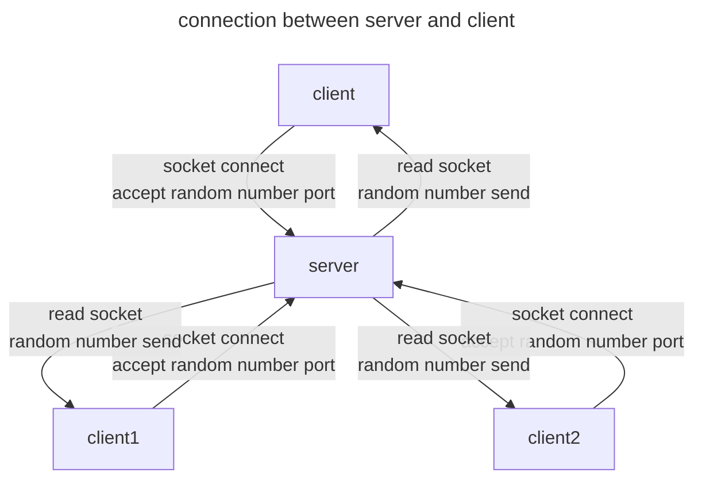
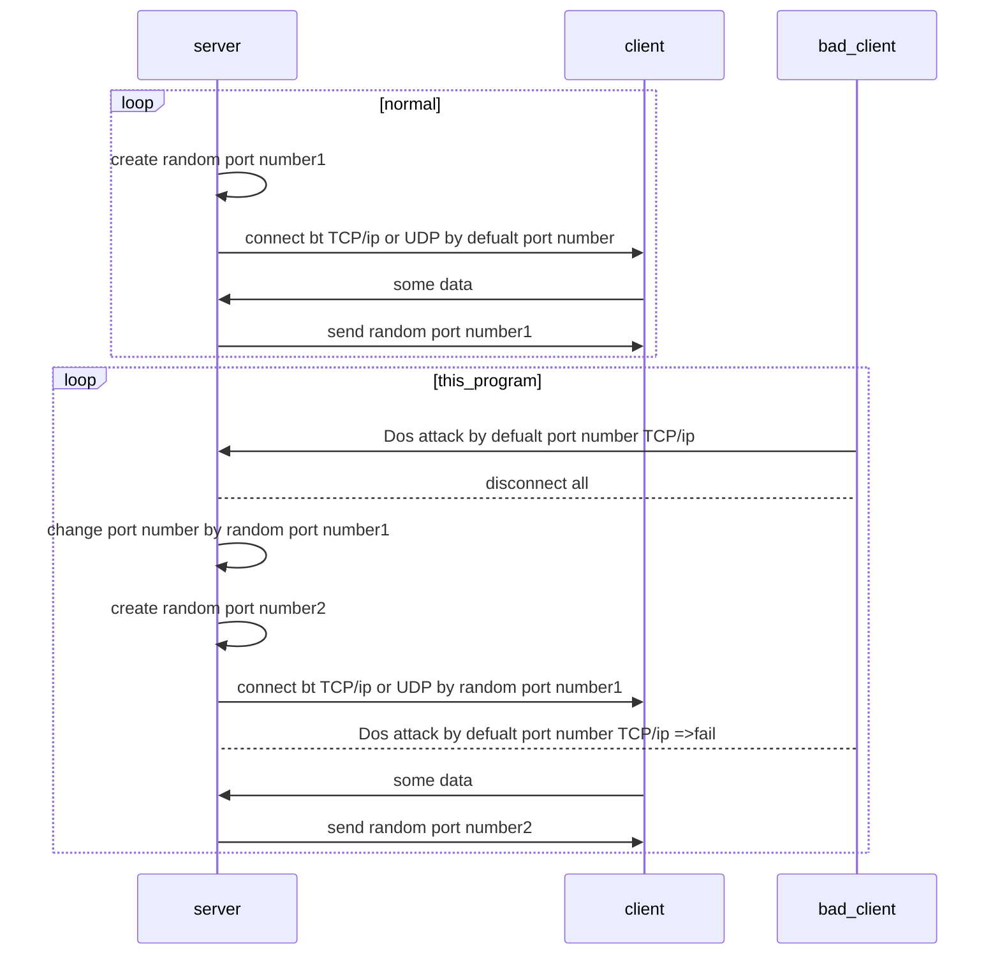

# iot_security_only_port_connect
(port번호를 변경하여 보안을 향상 시키는 코드)

---
app.c는 stm32용 파일임 
---

iot시스템의 보안은 key라는 고유의 비밀번호를 설정해 보안을 하는 방식임
그러나 key방식의 보안은 무한한 시도가 가능하다면 100%확률로 해킹이 가능하다는 문제가 존재
이를 해결하기 위해서 주기적으로 랜덤한 port번호를 생성하고 통신하여 보안성을 높이는 방법을 고안함
본 프로젝트는 key코드가 없는 상태에서 보안성 향상을 보여주기 위해 id:passward방식의 client가 아닌 port번호의 연속된 번호를 주어서 통신함
(The security of the IoT system is secured by setting a unique password called key.  
However, there is a problem with key-based security that hacking is possible with 100% probability if infinite attempts are possible.  
To solve this problem, we devised a method to increase security by periodically generating and communicating with random port numbers.  
In order to improve security in the absence of a key code,   
this project communicates by giving serial port numbers rather than the client using the id:password and key method.)  

// 추가로 랜덤한 변수를 uint32형으로 전송하여 port번호에 대한 보안성을 향상시킴

(The code operates in the following manner.   
Communication between server and client: client (creates sock and waits for connection)  
-> server (after connection, reads sock, stores random number value and sends it)  
-> repeats client 1 and 2.  
-> client (attempts to connect using the random number received from the server as the port)  
-> server (accepts by specifying the random number as the port)   
-> repeat client 1, 2 -> repeat  
// Additional random variables are sent as uint32 type to improve port number security.)

---
Project Review
---
" what is different to maintaining the connection after a single communication? "
" well this project can control time. 
for example if server device attack by DoS, server disconnect and change port return connect.
and evade DoS"

